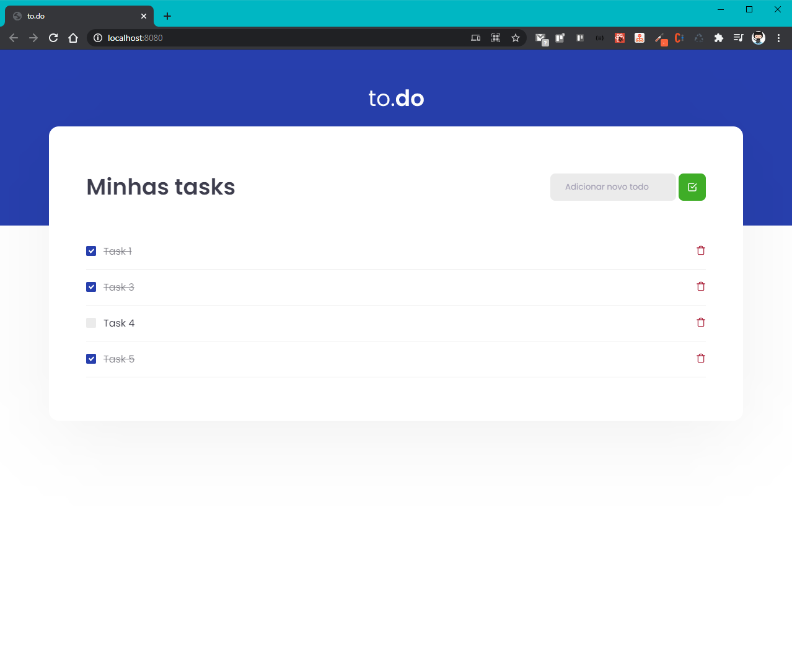

# RocketSeat 🔥 Ignite React ( Desafio Conceitos do React )

## ✔️ Projeto ToDo List
Este projeto de ToDo List é um desafio proposto para reforçar os conceitos aprendidos nas aulas do módulo de conceitos do ReactJs, consiste em implementar algumas funcionalidades para que a todo list funcione corretamente e passe nos testes automatizados.  

## 🧰 Tecnologias Utilizadas
* VSCode ( IDE )
* WebPack
* WebPack Dev Server
* SASS
* Source Maps
* Fast Refresh
* JavaScript
* React
* TypeScript
* Jest
* CrossEnv
  
# 🖼️ Imagens do Projeto

<div align="center"> 



</div>


## ⚙️ Rodando o Projeto
```bash
# Clone este repositório
$ git clone https://github.com/brunoemferreira/rocketseat-ignite-react-desafio-conceitos-react.git

# Baixar as bibliotecas utilizadas no projeto
$ yarn install
ou 
$ npm install

# Rodando o Projeto
$ yarn dev
ou 
$ npm dev

# Visualizando o projeto
http://localhost:8080

```
⌨️ com ❤️ por [Bruno Eduardo](https://gist.github.com/brunoemferreira) 😊


